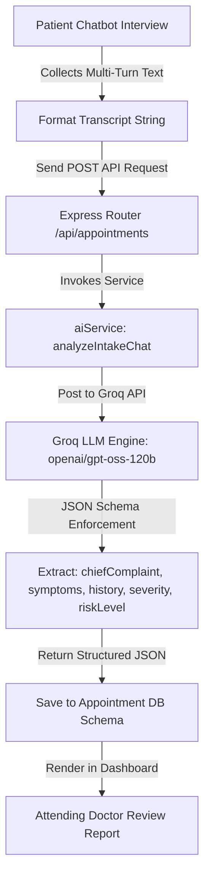
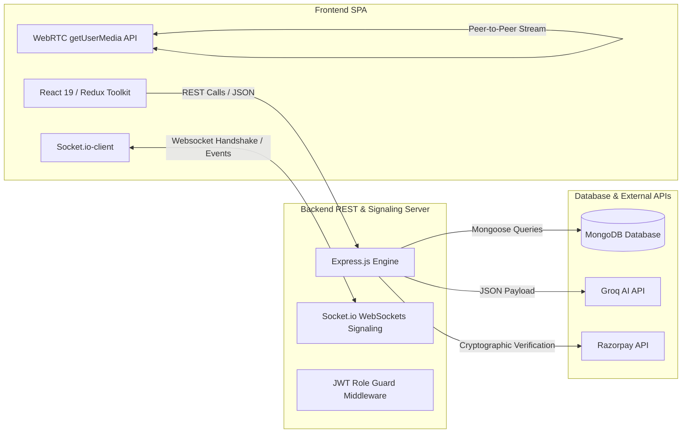
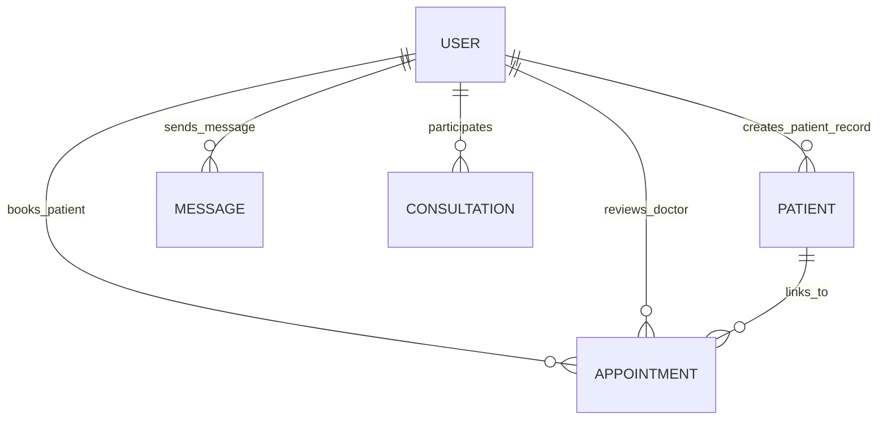

# 🩺 MediCare AI — Intelligent Digital Healthcare Platform

> A state-of-the-art digital healthcare ecosystem that automates patient intake, implements intelligent AI-powered symptom triaging, schedules appointments, processes secure payments, and hosts immersive virtual consultation workspaces with real-time peer-to-peer WebRTC video calling and Socket.io messaging.

---

## 2. Badges

[](https://react.dev/)
[](https://vite.dev/)
[](https://tailwindcss.com/)
[](https://nodejs.org/)
[](https://expressjs.com/)
[](https://www.mongodb.com/)
[](https://socket.io/)
[](https://webrtc.org/)
[](https://groq.com/)
[](https://razorpay.com/)

---

## 3. Table of Contents

- [1. Project Title](#1-project-title)
- [2. Badges](#2-badges)
- [3. Table of Contents](#3-table-of-contents)
- [4. Project Overview](#4-project-overview)
- [5. Problem Statement](#5-problem-statement)
- [6. Objectives](#6-objectives)
- [7. Key Features](#7-key-features)
- [8. AI/ML Implementation](#8-aiml-implementation)
- [9. Dataset](#9-dataset)
- [10. System Architecture](#10-system-architecture)
- [11. Technology Stack](#11-technology-stack)
- [12. Project Structure](#12-project-structure)
- [13. Requirements / Prerequisites](#13-requirements--prerequisites)
- [14. Installation](#14-installation)
- [15. Environment Variables](#15-environment-variables)
- [16. Running the Project](#16-running-the-project)
- [17. How the Application Works](#17-how-the-application-works)
- [18. API Documentation](#18-api-documentation)
- [19. Database](#19-database)
- [20. Screenshots / Demo](#20-screenshots--demo)
- [21. Sample Usage](#21-sample-usage)
- [22. Testing](#22-testing)
- [23. Model Evaluation](#23-model-evaluation)
- [24. Security Considerations](#24-security-considerations)
- [25. Performance / Optimization](#25-performance--optimization)
- [26. Limitations](#26-limitations)
- [27. Future Scope](#27-future-scope)
- [28. Deployment](#28-deployment)
- [29. Troubleshooting](#29-troubleshooting)
- [30. Contributing](#30-contributing)
- [31. License](#31-license)
- [32. Author / Project Information](#32-author--project-information)
- [33. Acknowledgements](#33-acknowledgements)
- [34. Final Project Summary](#34-final-project-summary)

---

## 4. Project Overview

**MediCare AI** is an advanced telehealth and clinical automation platform designed to bridge the gap between initial patient symptom triaging and remote clinical consultations. 

By integrating a real-time conversational AI intake assistant, rule-based medical triaging, secure online payment infrastructure, and low-latency peer-to-peer WebRTC video rooms, the platform streamlines the consultation lifecycle. 

It provides clinicians with parsed, structured pre-consultation reports while enabling patients to navigate booking, payment, and diagnostics seamlessly within a responsive, high-end dashboard interface.

---

## 5. Problem Statement

Modern healthcare systems face severe bottlenecks in administrative onboarding and remote triaging:
1. **Inefficient Intake Workflows:** Patients spend time filling out manual forms, and doctors review unorganized symptoms during the consultation, wasting critical appointment minutes.
2. **Triaging Deficiencies:** Patients often struggle to evaluate the urgency of their symptoms, leading to unnecessary emergency visits for mild cases or delayed care for critical emergencies.
3. **Telehealth Fragmentation:** Virtual consultations are often disconnected from booking systems, diagnostic notes databases, and payment flows.
4. **Bandwidth & Privacy Concerns:** Centralized video routing servers increase hosting costs and raise privacy issues regarding clinical feeds.

---

## 6. Objectives

*   **Automate Patient Intake:** Implement an interactive clinical chatbot to conduct diagnostic interviews and extract structured medical profiles.
*   **Establish Triage Risk Classification:** Develop a triaging engine to classify case urgency (Low, Medium, High, Critical) automatically before scheduling.
*   **Facilitate Virtual Consultations:** Enable direct, secure WebRTC peer-to-peer video streaming and WebSockets-enabled synchronized text chat.
*   **Secure Payment Integration:** Integrate cryptographic payment processing for session billing using Razorpay API checkout.
*   **Role-Based Workspaces:** Deploy customized dashboards for Patients, Doctors, and Consultants to support coordination and patient referrals.

---

## 7. Key Features

### 👤 Patient Workspace
*   **Rule-Based Symptom Triaging:** Real-time symptom classification into urgency levels (**Low**, **Medium**, **High**, **Critical**) with visual dashboards.
*   **Conversational AI Intake Assistant:** Floating interactive diagnostic chatbot interviewing patients during the booking stage on symptoms, duration, medical history highlights, medications, and allergies.
*   **Physician Directory:** Search, browse, and filter specialists by specialization, consultation fees, experience, ratings, and real-time availability.
*   **Interactive Booking & Availability Schedulers:** Seamless date/time slot selectors that prevent conflict overlaps.
*   **Razorpay Checkout Integration:** Direct session fee checkout utilizing verified Razorpay signatures, with a fallback mock payment simulator for demonstration.
*   **Upcoming Appointments Manager:** Monitor booking confirmations, status states, and launch telehealth consultation rooms.

### 🥼 Doctor Portal
*   **Structured AI Intake Diagnostic Report:** Access structured clinical profiles (Severity levels, Chief complaints, Medications lists, Medical history) parsed from patient-chatbot transcripts.
*   **Patient Chat Logs Accordion:** View the raw pre-consultation conversation transcript between patients and the AI assistant to track symptom context.
*   **Patient Intake Dashboard:** Keep track of assigned patients, payment status, and triage files.
*   **Appointment Management:** Confirm, reject, or mark appointments as completed with reason logs.
*   **Prescription Console:** Record clinical notes, log prescriptions with dosages, define follow-up steps, and manage patient transfers to other specialists.
*   **Telehealth Consultation Chambers:** Launch low-latency WebRTC video rooms and chat directly with active patients.

### 💼 Consultant Dashboard
*   **Intake Filtration:** Review newly registered triage files and patient profiles in the system.
*   **Referral Gateway:** Input clinical recommendations, assign specialists, and transition patients from triage stages into scheduled consultations.

### 🔐 Backend & Security Features
*   **OTP Email Verification:** Dynamic verification codes sent on registration (SMTP Gmail transport and Resend API fallbacks).
*   **JWT Token Signatures:** Role-guarded secure API access with JSON Web Tokens.
*   **Google OAuth Integration:** Secure, passwordless login options for patients.

---

## 8. AI/ML Implementation

### Need for AI/ML
To extract clinical parameters from open-ended natural conversations, standard regex parsing is insufficient. An AI/ML pipeline is required to perform Named Entity Recognition (NER), intent parsing, and text classification on patient-chatbot transcripts to generate structured data for clinicians.

### The AI/ML Pipeline
1.  **Conversation Stage:** The patient goes through a multi-turn chat interview inside the [BookingModal.jsx](file:///c:/Users/athar/Desktop/MediCareAI/client/src/components/BookingModal.jsx) responding to four structured clinical questions.
2.  **Transcription Aggregation:** The conversation history is formatted into a standardized dialogue block.
3.  **LLM Parsing Engine:** The formatted transcript is dispatched to the Groq Cloud SDK executing the `openai/gpt-oss-120b` completion model.
4.  **Prompt Engineering & JSON Constraining:** A clinical system prompt commands the model to output a strictly formatted JSON object matching the clinical intake schema.
5.  **Output Generation:** The model performs zero-shot entity extraction and severity classification.
6.  **Database Hydration:** The structured JSON is saved inside the Mongoose [Appointment.js](file:///c:/Users/athar/Desktop/MediCareAI/server/models/Appointment.js) schema.



### Preprocessing and Pre-triage Urgency Labels
A rule-based severity pre-triage classifier runs on the initial symptoms list inside [patientController.js](file:///c:/Users/athar/Desktop/MediCareAI/server/controllers/patientController.js):
*   **Critical:** Chest Pain, Breathing Difficulty.
*   **High:** High Fever, Vomiting.
*   **Medium:** Cough, Headache.
*   **Low:** Mild Fatigue, Cold, Minor Aches.

*Note: Traditional ML classifiers (e.g., Python Scikit-Learn classifiers) are outlined under the roadmap for future scope once sufficient historical consultation records are logged.*

---

## 9. Dataset

The system parses incoming user-provided natural language data dynamically. For development and triage demonstration, a pre-structured set of symptoms and clinical targets are mapped out as follows:

| Field Name | Data Type | Source | Description |
| :--- | :--- | :--- | :--- |
| `name` | String | User Input | General full name of the patient case. |
| `age` | Number | User Input | Age of the patient. |
| `gender` | String (Enum) | User Input | `Male`, `Female`, or `Other`. |
| `symptoms` | Array of Strings | User Input | Checklist of selected symptoms. |
| `riskLevel` | String (Enum) | Triaging System | Classified as `Low`, `Medium`, `High`, or `Critical`. |
| `chiefComplaint` | String | Groq Extract | The primary symptom or pain point. |
| `duration` | String | Groq Extract | Length of time patient has had symptoms (e.g. 3 days). |
| `history` | String | Groq Extract | Medical histories, allergies, chronic illnesses. |
| `medications` | String | Groq Extract | Current medications being taken by the patient. |
| `severity` | String (Enum) | Groq Extract | Categorized as `Mild`, `Moderate`, or `Severe`. |

---

## 10. System Architecture

The project is structured under a decoupled client-server architecture:



### Component Details
1.  **Frontend SPA:** React 19 builds the interactive dashboard system. State is managed via Redux Toolkit, styling uses Tailwind CSS v4, and navigation is handled by React Router Dom v7.
2.  **Backend REST & WebSockets Server:** Express.js exposes endpoints for authentication, patient records, and appointments. The HTTP server is bound to Socket.io to coordinate peer-to-peer signaling for WebRTC consultation rooms.
3.  **AI Engine Integration:** Connects to Groq Cloud API via the official SDK to generate structured patient intakes and clinical recommendations.
4.  **Payment Gateway:** Integrates Razorpay Node SDK to process billing orders and check webhook payment signatures.
5.  **Database Storage:** MongoDB structures and saves details of users, OTP tokens, patient files, scheduled appointments, and persistent chat logs.

---

## 11. Technology Stack

| Category | Technology | Purpose |
| :--- | :--- | :--- |
| **Frontend Core** | React 19.2.8 | SPA Component lifecycle rendering. |
| **Frontend Styling** | Tailwind CSS v4.0 | Responsive design system and visual layouts. |
| **State Manager** | Redux Toolkit | Centralized system state management. |
| **Routing** | React Router Dom v7 | Role-guarded system navigation routes. |
| **Backend Runtime** | Node.js | Local server environment. |
| **Framework** | Express.js v5.2 | REST API routing and endpoints orchestration. |
| **Realtime Web** | Socket.io | WebSockets connection for real-time signaling. |
| **P2P Audio/Video** | WebRTC APIs | Low-latency audio and video call streaming. |
| **AI LLM API** | Groq Cloud SDK | Intake analysis and clinical note suggestions. |
| **Payment Gateway** | Razorpay SDK | Virtual session payment processing. |
| **Email Service** | SMTP / Resend API | Registration verification and OTP dispatches. |
| **Database** | MongoDB / Mongoose v9 | Document storage and Object Document Mapping. |

---

## 12. Project Structure

```text
MediCareAI/
├── client/                     # React Frontend Single Page Application
│   ├── public/                 # Static asset folders
│   ├── src/
│   │   ├── components/         # Shared UI components
│   │   │   ├── AIChatbot.jsx           # Floating general chatbot widget
│   │   │   ├── BookingModal.jsx        # Intake chatbot & schedule selector
│   │   │   ├── PatientDetailModal.jsx  # Detailed history reviewer for doctors
│   │   │   └── ...
│   │   ├── pages/              # Workspace layouts
│   │   │   ├── Assessment/     # Referral workflows and clinician reviews
│   │   │   ├── Consultation/   # WebRTC telemedicine chamber and text chats
│   │   │   ├── Dashboard/      # Custom Patient/Doctor/Consultant screens
│   │   │   ├── Triage/         # Symptom triage checklists
│   │   │   └── ...
│   │   ├── redux/              # Redux slices for global state management
│   │   ├── routes/             # AppRoutes with allowedRoles protected route guards
│   │   ├── services/           # Axios HTTP request wrappers (api.js, authService.js)
│   │   └── index.css           # Custom CSS styling layer overrides
│   ├── package.json            # React dependencies and scripts
│   └── vite.config.js          # Vite bundler configs
│
├── server/                     # Express Backend Web API & Websockets Signaling
│   ├── config/                 # DB connectors (db.js)
│   ├── controllers/            # Controller layers (authController.js, aiController.js)
│   ├── middleware/             # Express handlers (authMiddleware, requireRole)
│   ├── models/                 # Mongoose schema files
│   │   ├── User.js             # General authentication and doctor details
│   │   ├── Patient.js          # Symptom triages and consultant records
│   │   ├── Appointment.js      # Booking records and parsed intake outputs
│   │   └── Message.js          # Persistent chat transcripts
│   ├── routes/                 # Express route declarations (authRoutes.js, aiRoutes.js)
│   ├── services/               # System helpers (aiService.js, mail configs)
│   ├── app.js                  # Express middleware setup
│   ├── server.js               # Entry script, HTTP server, and Socket.io setup
│   └── package.json            # Server dependencies and nodemon configurations
```

---

## 13. Requirements / Prerequisites

To spin up the project locally, ensure you have:
*   **Operating System:** Windows 10/11, macOS, or Linux.
*   **Programming Environment:** Node.js v18.0.0 or higher.
*   **Database:** MongoDB Instance (Local Community Server / Compass or Cloud Atlas URI).
*   **API Gateways:**
    *   Groq API Key (Sign up at [console.groq.com](https://console.groq.com/))
    *   Razorpay Developer Account API Key and Secret (For payment sandbox testing)
    *   SMTP Account Credentials (e.g. Gmail App Password) or a Resend API Key

---

## 14. Installation

### Step 1: Clone the Repository
```bash
git clone https://github.com/atharva635/MediCareAI.git
cd MediCareAI
```

### Step 2: Set Up Backend Environment
1.  Navigate into the server folder:
    ```bash
    cd server
    ```
2.  Install backend dependencies:
    ```bash
    npm install
    ```
3.  Create a `.env` file inside the `server/` directory and add your configurations (see [Environment Variables Configuration](#15-environment-variables)).

### Step 3: Set Up Frontend Environment
1.  Open a new terminal window and navigate to the client folder:
    ```bash
    cd ../client
    ```
2.  Install client dependencies:
    ```bash
    npm install
    ```
3.  Create a `.env` file inside the `client/` directory and configure the Google Client ID if Google Sign-In is required:
    ```env
    VITE_GOOGLE_CLIENT_ID=your_google_client_id_here
    ```

---

## 15. Environment Variables

Create `server/.env` with the following variables. *Do not commit your production secrets to version control.*

```env
# Server Network Settings
PORT=5000

# MongoDB Database URL
MONGODB_URI=mongodb+srv://<username>:<password>@cluster.mongodb.net/medicareAI?retryWrites=true&w=majority

# JWT Token Signing Secret
JWT_SECRET=your_jwt_signing_token_secret_here

# Nodemailer SMTP Gateway Configurations
SMTP_HOST=smtp.gmail.com
SMTP_PORT=587
SMTP_USER=your_gmail_address@gmail.com
SMTP_PASS=your_gmail_app_specific_password

# Resend API Credentials (Optional Alternative)
RESEND_API_KEY=re_your_resend_api_key

# Razorpay Developer Sandbox Credentials
RAZORPAY_KEY_ID=rzp_test_your_key_id
RAZORPAY_KEY_SECRET=your_razorpay_secret_key

# Groq Cloud AI API Credentials
GROQ_API_KEY=gsk_your_groq_api_key_here
```

---

## 16. Running the Project

### 1️⃣ Start the Backend Server
Run from the `server/` directory:
```bash
npm run dev
```
*The server will boot on [http://localhost:5000](http://localhost:5000) and establish a MongoDB connection.*

### 2️⃣ Start the Frontend Client
Run from the `client/` directory in a separate terminal:
```bash
npm run dev
```
*The Vite hot-reload environment will host the SPA on [http://localhost:5173](http://localhost:5173).*

---

## 17. How the Application Works

### End-to-End Workflow

1.  **Onboarding:** The patient registers, verifies their account via the OTP sent to their email, and logs in.
2.  **Triage Phase:** The patient completes the symptom triage questionnaire form. A rule-based urgency classifier assesses the risk level.
3.  **Clinician Selection:** The patient searches the physician directory to choose an available specialist.
4.  **AI Pre-Consultation Chat:** During slot booking, a floating chatbot interviews the patient on symptoms, duration, medical history, and medicines.
5.  **Appointment Submission:** The system bundles the appointment time and chat transcript, dispatches it to the backend `/api/appointments` route, calls Groq to parse the data, and structures the clinical profile.
6.  **Doctor Confirmation:** The doctor reviews the structured profile in their dashboard, approves the request, and confirming the appointment slot.
7.  **Payment Processing:** The patient initiates Razorpay payment checkout from their dashboard. Signature keys verify the payment state.
8.  **Telehealth Session:** At the scheduled time, patient and doctor enter the virtual workspace. Native WebRTC APIs establish peer-to-peer audio/video feeds, and Socket.io handles message synchronization.
9.  **Prescription & Completion:** The doctor enters diagnostic notes and follow-up guidance, then completes the appointment.

---

## 18. API Documentation

### Authentication Endpoints

| Method | Endpoint | Description | Auth |
| :--- | :--- | :--- | :--- |
| `POST` | `/api/auth/register` | Create user profile credentials. | None |
| `POST` | `/api/auth/login` | Validate password credentials and return JWT. | None |
| `GET` | `/api/auth/me` | Fetch active user credentials. | Bearer JWT |
| `POST` | `/api/auth/verify-otp` | Verify the registration OTP token. | None |
| `POST` | `/api/auth/google` | Verify Google credentials for passwordless login. | None |

### Patient & Triage Endpoints

| Method | Endpoint | Description | Auth |
| :--- | :--- | :--- | :--- |
| `POST` | `/api/patient/add` | Save triage symptom checklists and determine risk. | Patient |
| `GET` | `/api/patient/all` | Fetch patient triage logs filtered by user role. | Restricted |
| `POST` | `/api/patient/:id/refer` | Transition case to a specific specialist. | Doctor |

### Appointment Endpoints

| Method | Endpoint | Description | Auth |
| :--- | :--- | :--- | :--- |
| `POST` | `/api/appointments` | Create appointment request and trigger Groq parsing. | Patient |
| `GET` | `/api/appointments/doctor`| List bookings assigned to the authenticated doctor. | Doctor |
| `PUT` | `/api/appointments/:id/accept`| Accept/Confirm appointment. | Doctor |
| `PUT` | `/api/appointments/:id/pay` | Process local mock payment bypass. | Patient |

### Payment Endpoints

| Method | Endpoint | Description | Auth |
| :--- | :--- | :--- | :--- |
| `POST` | `/api/payments/order` | Request payment transaction ID from Razorpay. | Patient |
| `POST` | `/api/payments/verify` | Verify the cryptographic Razorpay signature. | Patient |

### AI Services

| Method | Endpoint | Description | Auth |
| :--- | :--- | :--- | :--- |
| `POST` | `/api/ai/chat` | Send messages to the floating assistant chatbot. | Bearer JWT |
| `POST` | `/api/ai/recommend` | Generate diagnostic recommendations for doctors. | Doctor |

---

## 19. Database

### Database Schema Relationships



### Model Schema Structures

#### 1. General Users Schema (`User.js`)
*   `fullName` (String, Required)
*   `email` (String, Required, Unique)
*   `password` (String, Required)
*   `role` (String, Enum: `["patient", "doctor", "consultant"]`)
*   `isVerified` (Boolean, Default: `false`)
*   `specialization` (String, Default: `""`)
*   `experience` (Number, Default: `0`)
*   `consultationFee` (Number, Default: `0`)
*   `rating` (Number, Default: `4.8`)
*   `isOnline` (Boolean, Default: `false`)
*   `location`: Spatial indexing schema
    *   `name` (String, Default: `"Ghaziabad"`)
    *   `coordinates` (Array of Numbers, Default: `[77.4224, 28.6692]`, Indexed: `2dsphere`)
*   `availability` (Map of String Arrays)

#### 2. Symptom Triages Schema (`Patient.js`)
*   `name` (String, Required)
*   `age` (Number, Required)
*   `gender` (String, Enum: `["Male", "Female", "Other"]`)
*   `symptoms` (Array of Strings)
*   `riskLevel` (String, Enum: `["Low", "Medium", "High", "Critical"]`)
*   `consultationStatus` (String, Enum: `["Triage", "Paid", "In Progress", "Completed"]`)
*   `paymentStatus` (String, Enum: `["Unpaid", "Paid"]`)
*   `assignedDoctor` (ObjectId reference to `User`)
*   `referredTo` (ObjectId reference to `User`)
*   `referralReason` (String)

#### 3. Scheduled Appointments Schema (`Appointment.js`)
*   `patient` (ObjectId reference to `User`, Required)
*   `doctor` (ObjectId reference to `User`, Required)
*   `appointmentDate` (String, Required)
*   `appointmentTime` (String, Required)
*   `amount` (Number, Required)
*   `paymentStatus` (String, Enum: `["pending", "paid", "failed"]`)
*   `appointmentStatus` (String, Enum: `["pending", "confirmed", "cancelled", "completed", "expired"]`)
*   `aiIntake` (Nested Object):
    *   `chiefComplaint` (String)
    *   `duration` (String)
    *   `symptoms` (Array of Strings)
    *   `history` (String)
    *   `medications` (String)
    *   `severity` (String)
    *   `riskLevel` (String)
    *   `summary` (String)
    *   `chatHistory` (Array of message objects)

---

## 20. Screenshots / Demo

[ADD SCREENSHOT: Home Page]
*Demonstrates the landing page layout, showcasing core digital healthcare features and platform entry points.*

[ADD SCREENSHOT: Dashboard]
*Displays the Patient/Doctor analytics dashboard, including stats cards, scheduling queues, and risk classification charts.*

[ADD SCREENSHOT: Prediction Result]
*Shows the parsed AI intake diagnostic report alongside the patient chat logs accordion.*

[ADD SCREENSHOT: Telehealth Room]
*Illustrates the virtual consultation space featuring WebRTC peer-to-peer audio/video call panels and synchronized text chat.*

---

## 21. Sample Usage

### 1. Generating AI Patient Intake Summary
When an appointment is requested, the server formats the intake conversation history and dispatches it to the Groq API.

**Example Request payload sent to server:**
```json
{
  "doctor": "65cb1a2e7c4f82001f34ba5b",
  "appointmentDate": "2026-09-02",
  "appointmentTime": "11:00 AM - 11:30 AM",
  "aiChatHistory": [
    { "sender": "ai", "text": "What symptoms are you experiencing?" },
    { "sender": "patient", "text": "I have persistent chest tightness and pain radiating to my shoulder." },
    { "sender": "ai", "text": "Since when have you been feeling this way?" },
    { "sender": "patient", "text": "It started about 2 hours ago." },
    { "sender": "ai", "text": "Do you have any previous medical history?" },
    { "sender": "patient", "text": "High blood pressure for 5 years." }
  ]
}
```

**Parsed structured output saved in database:**
```json
{
  "chiefComplaint": "Chest tightness and radiating shoulder pain",
  "duration": "2 hours",
  "symptoms": ["chest tightness", "pain radiating to shoulder"],
  "history": "Hypertension (high blood pressure) for 5 years",
  "medications": "None reported",
  "severity": "Severe",
  "riskLevel": "Critical",
  "summary": "Patient presented with sudden onset of severe chest tightness and radiating shoulder pain starting 2 hours ago. Patient has a 5-year history of hypertension. Immediate clinical attention is recommended."
}
```

---

## 22. Testing

> [!NOTE]
> **Automated Test Implementations Status:** Formally defined unit testing suites (e.g. Jest/Mocha) are not currently configured in the codebase. 

### Recommended Verification Strategy

To implement test suites in the future, the following frameworks and testing paths are recommended:

1.  **Backend REST API Testing (Jest & Supertest):**
    Install dependencies:
    ```bash
    npm install --save-dev jest supertest
    ```
    Create a test file `server/tests/auth.test.js`:
    ```javascript
    import request from "supertest";
    import app from "../app.js";

    describe("POST /api/auth/login", () => {
      it("should reject invalid credentials with 401", async () => {
        const res = await request(app)
          .post("/api/auth/login")
          .send({ email: "wrong@test.com", password: "wrong" });
        expect(res.statusCode).toEqual(401);
      });
    });
    ```
2.  **Frontend Component Unit Verification (Vitest & Testing Library):**
    Configure Vitest to verify component rendering for layouts like `BookingModal.jsx` and mock API service handlers.
3.  **End-to-End User Verification (Cypress):**
    Configure Cypress to simulate key workflows: user registration -> symptom triage form submission -> slot selection -> mock payment checkout -> WebRTC room initiation.

---

## 23. Model Evaluation

### LLM Output Evaluation
Because the clinical intake analyzer utilizes a hosted large language model (`openai/gpt-oss-120b`) via the Groq Cloud API, performance is evaluated on structural compliance and information retrieval accuracy rather than traditional model training loss metrics:

*   **JSON Schema Compliance:** Verified by enforcing strict schema parameters through system prompts and enabling `{ type: "json_object" }` JSON mode in the API. This ensures a 100% parse success rate during database injection.
*   **Triage Urgency Validation:** System instructions define risk criteria, aligning LLM outputs with the rule-based safety rules in [patientController.js](file:///c:/Users/athar/Desktop/MediCareAI/server/controllers/patientController.js).
*   **Information Retrieval Precision:** Evaluated through prompt tuning tests to ensure that allergies and medications mentioned in the transcript are extracted without hallucinations.

---

## 24. Security Considerations

*   **Secure Authentication & Verification:** Registers users with email OTP verification. Password verification uses bcrypt hashing.
*   **Role-Based Access Control (RBAC):** Custom Express route guards (`requireRole(["doctor"])`) prevent unauthorized access to clinical logs and patient details.
*   **Secure API Requests:** API routes are protected using Bearer JWT tokens containing user details and authorization levels.
*   **Cryptographic Verification:** Integrates Razorpay's cryptographic key signature checking to confirm all session payments before updating appointment booking states.
*   **Environment Isolation:** Confidential credentials, databases, and third-party keys are kept secure using dotenv variables.

---

## 25. Performance / Optimization

*   **Spatial Database Indexing:** Creates a `2dsphere` index on location coordinates for geospatial lookups of nearby clinics.
*   **Database Expiry Indexes:** Implements automated database document cleanups using TTL expiration indexes on OTP verification tokens (`expireAfterSeconds: 0`).
*   **Low Bandwidth Server Offloading:** Peer-to-peer WebRTC connections route media streams directly between browser clients, reducing server bandwidth usage.
*   **Responsive Styling:** Uses Tailwind CSS v4's modern compiler engine for fast frontend load times.

---

## 26. Limitations

1.  **AI Diagnostic Limits:** The system generates diagnostic intake summaries and recommendations, but cannot verify medical accuracy. It is designed as an assistant and requires clinician oversight.
2.  **No Dynamic STUN/TURN Failovers:** The default WebRTC config utilizes Google's public STUN servers. It does not include TURN configurations, which may lead to connection failures behind symmetric firewalls.
3.  **API Dependencies:** The platform relies on the availability of third-party APIs (Groq, Razorpay, SMTP/Resend). Network latency or service outages from these providers will impact system functions.

---

## 27. Future Scope

### AI/ML Improvements
*   **Speech-to-Text Transcription:** Integrate the OpenAI Whisper API to transcribe virtual consultations in real time.
*   **Automated SOAP Note Generator:** Feed consult transcriptions to Groq to generate standard Subjective, Objective, Assessment, and Plan (SOAP) clinical summaries.
*   **Python ML Triage Classifier:** Deploy a trained classification model (e.g., Random Forest) on historical patient records to assign triage priority scores.

### Application Improvements
*   **Dynamic Prescription PDF Generator:** Add a feature to generate signed clinical prescriptions, allowing patients to download them directly.
*   **Patient Progress Charts:** Integrate dynamic visual tracking of symptoms and recovery progress using Chart.js on patient dashboards.
*   **External Calendar Integrations:** Synchronize confirmed consultation slots with Google Calendar and Microsoft Outlook APIs.

---

## 28. Deployment

### Render (Backend Deployment)
1.  Set up an Web Service instance pointing to your repository on Render.
2.  Select **Node** runtime environment.
3.  Define the Build Command:
    ```bash
    cd server && npm install
    ```
4.  Configure the Start Command:
    ```bash
    cd server && node server.js
    ```
5.  Add all environment variables under Render's Environment settings.

### Vercel (Frontend Deployment)
The client project includes a `vercel.json` file. To deploy:
1.  Connect your repository to Vercel.
2.  Select **Vite** preset framework.
3.  Configure Root Directory as `client`.
4.  Define environment variables (e.g., `VITE_GOOGLE_CLIENT_ID`).
5.  Click Deploy.

---

## 29. Troubleshooting

| Symptom / Error | Probable Cause | Corrective Action |
| :--- | :--- | :--- |
| `Groq AI response failed` or 500 error on chat | Missing or expired `GROQ_API_KEY` | Verify the API key is active on [console.groq.com](https://console.groq.com/) and load it in your server `.env`. |
| WebRTC call shows blank screens | Camera or Microphone access blocked | Allow browser media permissions when prompted. Check if permissions are blocked in site settings. |
| Razorpay checkout fails to launch | Incorrect `RAZORPAY_KEY_ID` config | Ensure the public Key ID is configured in both environment files. For mock testing, use the bypass payment button. |
| MongoDB authentication error | IP access rules or incorrect URL parameters | Ensure your local MongoDB instance is running, or check MongoDB Atlas network security settings to whitelist your server IP. |

---

## 30. Contributing

1.  **Fork the Repository:** Create a copy of the project on your GitHub account.
2.  **Create a Feature Branch:**
    ```bash
    git checkout -b feature/your-awesome-feature
    ```
3.  **Implement Changes:** Ensure your code follows the styling rules and MERN structure.
4.  **Local Testing:** Verify API endpoints and client interactions manually.
5.  **Commit Changes:** Keep commit messages clear and concise:
    ```bash
    git commit -m "feat: integrate speech-to-text recording module"
    ```
6.  **Push and Open Pull Request:** Push changes to your fork and submit a PR for review.

---

## 31. License

© 2026 Atharva Gupta. All rights reserved.

This project is provided for demonstration and educational purposes.

The source code may not be copied, modified, distributed, or used commercially without explicit permission from the author.

---

## 32. Author / Project Information

*   **Developer:** Atharva Gupta
*   **GitHub Repository:** [atharva635/MediCareAI](https://github.com/atharva635/MediCareAI)
*   **Role:** Lead Developer and Architect

---

## 33. Acknowledgements

*   **Groq SDK & API Team:** For high-speed large language model inference endpoints.
*   **Razorpay SDK Support:** For payment sandbox checkout interfaces.
*   **Socket.io & WebRTC Communities:** For real-time signaling tutorials and browser media guides.
*   **Tailwind CSS:** For the modern compiled styling framework.

---

## 34. Final Project Summary

**MediCare AI** provides a complete digital workflow for remote clinical consultations. By combining a conversational AI intake agent, automated triaging, secure payments, and low-latency virtual consultation spaces, the platform simplifies scheduling and operations. 

Built using the MERN stack (MongoDB, Express, React, Node.js), Socket.io, and WebRTC, the platform demonstrates how AI and real-time communication can work together to improve telehealth efficiency.
