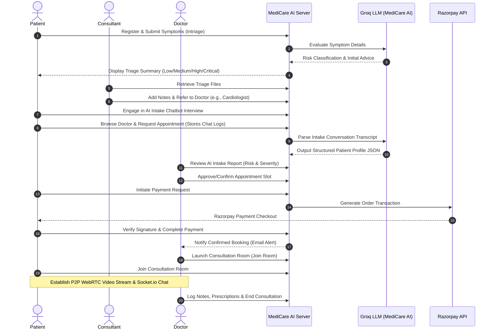

# 🩺 MediCare AI — Intelligent Digital Healthcare Platform

[](https://react.dev/)
[](https://tailwindcss.com/)
[](https://nodejs.org/)
[](https://www.mongodb.com/)
[](https://webrtc.org/)
[](https://socket.io/)
[](https://groq.com/)
[](https://razorpay.com/)

**MediCare AI** is a state-of-the-art digital healthcare ecosystem that automates patient intake, implements intelligent AI-powered symptom triaging, schedules appointments, processes secure payments, and hosts immersive virtual consultation workspaces with real-time peer-to-peer WebRTC video calling and Socket.io messaging.

---

## 🗺️ System Flow & Consultation Lifecycle

The following sequence details how patients, consultants, and doctors interact through MediCare AI, powered by AI routing and real-time signaling:



---

## ✨ Features & Core Modules

### 👤 Patient Workspace
*   **AI Symptoms Triage:** Perform preliminary symptom analysis. Patients receive automated advice and risk-level categorization (**Low**, **Medium**, **High**, **Critical**) based on input severity metrics before scheduling an appointment.
*   **Conversational AI Intake Agent:** When booking a consultation slot, patients go through an interactive chatbot interview that captures symptoms, duration, medical history highlights, daily medications, and allergies.
*   **Physician Directory:** Browse verified lists of doctors filtered by specializations, consultation fees, experience, ratings, and current active availability.
*   **Interactive Booking:** Select date/time slots with automatic conflict prevention (prevents overlapping schedules).
*   **Secure Payment Integration:** Integrated checkout using the **Razorpay API** to process session/platform fees with cryptographically verified payment signatures.
*   **Virtual Ward & Chat:** Access virtual call chambers for high-fidelity audio/video calls and chat histories.

### 🥼 Doctor Portal
*   **AI Intake Diagnostic Report:** Before confirming appointments, doctors can review a parsed clinical profile showing severity levels (Mild, Moderate, Severe), risk categories (Low, Medium, High, Critical), chief complaints, medications list, and medical history highlights.
*   **Patient Chat Logs Accordion:** View exact pre-consultation transcripts between patients and the AI assistant to track symptoms context.
*   **Patient Intake Dashboard:** View a complete list of triaged patient files, diagnostic logs, and historical consultations.
*   **Appointment Management:** Accept, decline, or complete upcoming appointments with inline reason logs.
*   **Prescription Console:** Record consultation outcomes, write clinical notes, input prescriptions, specify follow-up instructions, or transfer patients to other specialists.
*   **P2P Telemedicine:** Directly initiate secure WebRTC video calls with patients alongside inline chat messaging.

### 💼 Consultant Dashboard
*   **Intake Filtration:** Review newly registered triaged cases in the system.
*   **Referral Gateway:** Input guidance notes, assign specialists, and transition patients from triage stages into scheduled appointments.

### 🔐 Authentication & Security
*   **OTP Verification:** Registering users receive dynamic OTPs (via Resend or SMTP fallbacks) to verify their email addresses.
*   **JWT Token Signatures:** Secure REST APIs use Bearer tokens containing user roles and ID.
*   **Google OAuth:** Implemented Google login integration for fast, passwordless patient boarding.
*   **Role-Based Security Guards:** Express middleware controls page access (Patient vs. Doctor vs. Consultant).

---

## 🛠️ Tech Stack

### Frontend (Client)
*   **Library:** React 19 (ESNext modules)
*   **Build Tool:** Vite
*   **State Management:** Redux Toolkit (`@reduxjs/toolkit` & `react-redux`)
*   **Navigation:** React Router Dom (v7)
*   **Styles:** Tailwind CSS (v4)
*   **Graphics & Visualization:** Chart.js & React-Chartjs-2
*   **Telehealth:** Socket.io-client & native Browser WebRTC APIs

### Backend (Server)
*   **Runtime:** Node.js
*   **Framework:** Express.js (v5)
*   **Database:** MongoDB with Mongoose ODM
*   **Realtime Signaling:** Socket.io
*   **AI Engine:** Groq SDK (utilizing `openai/gpt-oss-120b` for JSON-structured intake profiles)
*   **Payment Processor:** Razorpay SDK
*   **Notification Engine:** Resend API & Nodemailer (SMTP configs)

---

## 📁 Repository Structure

```text
MediCareAI/
├── client/                     # Frontend SPA Application
│   ├── public/                 # Static Assets (Logos, Icons)
│   ├── src/
│   │   ├── components/         # Shared Components (Sidebar, Navbar, Loader, BookingModal, AIChatbot)
│   │   │   ├── AIChatbot.jsx           # Floating AI symptoms helper chat widget
│   │   │   ├── BookingModal.jsx        # Booking scheduler & interactive clinical intake conversation
│   │   │   ├── PatientDetailModal.jsx  # Detailed patient history & logs for doctor/consultant review
│   │   │   └── ...
│   │   ├── hooks/              # Custom React Hooks
│   │   ├── layouts/            # Page layout wrappers
│   │   ├── pages/              # Module Workspaces
│   │   │   ├── Assessment/     # Doctor patient intake assessment registers
│   │   │   ├── Consultation/   # WebRTC telemedicine room + Chat persistence
│   │   │   ├── Dashboard/      # Dashboards for Patient, Doctor, and Consultant
│   │   │   ├── DoctorList/     # Doctor directory for patient booking
│   │   │   ├── Triage/         # Symptom triage questionnaire page
│   │   │   └── ...
│   │   ├── redux/              # Redux Slices (Auth and system states)
│   │   ├── routes/             # App Router with Role-Protected Routes
│   │   ├── services/           # Axios Base Instances & API Handlers
│   │   └── utils/              # Helper functions
│   ├── package.json
│   └── vite.config.js
│
├── server/                     # Backend API & WebSocket Server
│   ├── config/                 # MongoDB database adapter & configs
│   ├── controllers/            # Controller Handlers (Auth, Payments, AI, Appointments, Patients)
│   ├── middleware/             # Route guards (JWT verification, Role validators)
│   ├── models/                 # Mongoose Database Schemas
│   │   ├── User.js             # General credentials, roles, and doctor details
│   │   ├── Patient.js          # Symptoms database logs & triage cases
│   │   ├── Appointment.js      # Appointments logs & AI intake report structures
│   │   ├── OTP.js              # Verification token records
│   │   ├── Message.js          # Telehealth room chat logs
│   │   └── consultation.js     # Consultation session metadata
│   ├── routes/                 # Express REST Endpoints
│   ├── services/               # Resend, Nodemailer SMTP, and Groq AI services
│   ├── validations/            # Request payload validation schemas
│   ├── app.js                  # Express middleware declarations
│   ├── server.js               # Entry point (HTTP Server, Socket.io signaling configuration)
│   └── package.json
```

---

## ⚙️ Environment Variables Configuration

To run MediCare AI locally, configure a `.env` file within the `server/` directory.

Create the file: `server/.env`
```env
# Network Server Config
PORT=5000

# MONGODB CONNECTION
MONGODB_URI=your_mongodb_connection_string

# Authentication secret
JWT_SECRET=your_jwt_signing_token_secret

# Email Gateway Config (SMTP / Nodemailer)
SMTP_HOST=smtp.gmail.com
SMTP_PORT=587
SMTP_USER=your_email_address@gmail.com
SMTP_PASS=your_email_app_specific_password

# Resend API Key (Alternative Email Service)
RESEND_API_KEY=re_xxxxxxxxxxxxxxxxxxxxxxxxxxxx

# Razorpay Configuration
RAZORPAY_KEY_ID=rzp_test_xxxxxx
RAZORPAY_KEY_SECRET=xxxxxxxxxxxxxxxxxxxxx

# AI Engine Credentials (Groq)
GROQ_API_KEY=gsk_xxxxxxxxxxxxxxxxxxxxxxxxxxxxxxxxxxxx
```

---

## 🚀 Installation & Local Development

### Prerequisites
*   [Node.js](https://nodejs.org/en) (v18 or higher recommended)
*   [MongoDB Compass](https://www.mongodb.com/products/tools/compass) or a MongoDB Atlas Cloud Database

### 1️⃣ Clone the Repository
```bash
git clone https://github.com/atharva635/MediCareAI.git
cd MediCareAI
```

### 2️⃣ Spin Up Backend Server
```bash
# Navigate to Server directory
cd server

# Install Node dependencies
npm install

# Start local server in development mode (hot reloading via nodemon)
npm run dev
```
*The server will initialize at `http://localhost:5000`.*

### 3️⃣ Spin Up Frontend Client
```bash
# Open a new terminal and navigate to client directory
cd client

# Install packages
npm install

# Launch Development Client
npm run dev
```
*The frontend client will launch at `http://localhost:5173`.*

---

## 📡 API Reference Summary

All requests are pre-configured to hit: `https://medicareai-backend-lp1l.onrender.com/api` (Production) or `http://localhost:5000/api` (Local Development).

| Category | Endpoint | Method | Description | Auth Requirement |
| :--- | :--- | :--- | :--- | :--- |
| **Auth** | `/api/auth/register` | `POST` | User registration (patient, doctor, consultant) | None |
| **Auth** | `/api/auth/login` | `POST` | Login user & sign JWT | None |
| **Auth** | `/api/auth/me` | `GET` | Retrieve logged-in user profile details | Bearer JWT |
| **Auth** | `/api/auth/verify-otp` | `POST` | Verifies dynamic email signup OTP | None |
| **Auth** | `/api/auth/resend-otp` | `POST` | Resends OTP verification code | None |
| **Auth** | `/api/auth/forgot-password`| `POST` | Generates recovery OTP for account | None |
| **Auth** | `/api/auth/reset-password` | `POST` | Resets user password using valid token | None |
| **Auth** | `/api/auth/google` | `POST` | Integrates/logs user in using Google token | None |
| **Patients**| `/api/patient` | `POST` | Submit triage details & intake symptom list | Patient / Doctor |
| **Patients**| `/api/patient/all` | `GET` | Fetch all triage records for the workspace | Role Restricted |
| **Appointments**| `/api/appointments` | `POST` | Book appointment slot. Accepts `aiChatHistory` in request body to trigger Groq parsing. | Patient |
| **Appointments**| `/api/appointments/doctor`| `GET` | View appointments assigned to currently authenticated doctor | Doctor |
| **Payments**| `/api/payments/order` | `POST` | Generate Razorpay order ID | Patient |
| **Payments**| `/api/payments/verify`| `POST` | Confirm Razorpay cryptographic signature | Patient |
| **AI** | `/api/ai/chat` | `POST` | Direct chatbot assistance stream | Bearer JWT |

---

## 🗃️ Database Schemas (MongoDB models)

### 👤 `User`
Manages general authentication, authorization levels, and roles. Stashes special parameters for physicians if user role is `"doctor"`.
*   `fullName` (String, required)
*   `email` (String, required, unique)
*   `password` (String, required)
*   `role` (`patient`, `doctor`, `consultant`)
*   `isVerified` (Boolean, defaults to false)
*   `specialization` (String, for Doctors)
*   `experience` (Number, for Doctors)
*   `consultationFee` (Number, for Doctors)
*   `rating` (Number, defaults to 4.8)
*   `isOnline` (Boolean)
*   `location`: Geolocation parameters (`2dsphere` index coordinates for location searches)
*   `availability`: Map representing days of the week and active time slots (`AvailabilityModal`)

### 🏥 `Patient`
Handles symptom triage submissions, severity levels, payment states, and referral transfers.
*   `name` (String, required)
*   `age` (Number, required)
*   `gender` (Male, Female, Other)
*   `symptoms` (Array of Strings)
*   `riskLevel` (Low, Medium, High, Critical)
*   `consultationStatus` (Triage, Paid, In Progress, Completed)
*   `paymentStatus` (Unpaid, Paid)
*   `assignedDoctor` (ObjectId reference to User)
*   `referredTo` (ObjectId reference to User)
*   `referralReason` (String)
*   `doctorNotes` / `consultantNotes` (String)

### 📅 `Appointment`
Connects Patient and Doctor models. Hosts date/time scheduling constraints, Razorpay orders, and the parsed AI clinical intake profile.
*   `patient` (ObjectId reference to User)
*   `doctor` (ObjectId reference to User)
*   `appointmentDate` (String)
*   `appointmentTime` (String)
*   `paymentStatus` (pending, paid, failed)
*   `appointmentStatus` (pending, confirmed, cancelled, completed, expired)
*   `aiIntake`: Nested object summarizing the intake chatbot's conversation:
    *   `chiefComplaint` (String)
    *   `duration` (String)
    *   `symptoms` (Array of Strings)
    *   `history` (String)
    *   `medications` (String)
    *   `severity` (Mild, Moderate, Severe)
    *   `riskLevel` (Low, Medium, High, Critical)
    *   `summary` (Concise clinical paragraph)
    *   `chatHistory`: Array of message objects (sender, text, timestamp) representing the complete transcript.

---

## 📡 WebRTC Telehealth & Signaling Details

The virtual consultation room uses **WebRTC** (Web Real-Time Communication) to link patients and doctors directly.

1.  **Room Entry:** Both patient and doctor join a socket room matching their `appointmentId`.
2.  **Signaling Relay:** When the doctor opens the room:
    *   Doctor fires `join-room`.
    *   Patient fires `join-room`.
    *   The browser client generates an SDP (Session Description Protocol) offer.
    *   The client sends `webrtc-offer` to the Node.js server.
    *   The Node.js server relays the offer to the corresponding peer in the room.
3.  **SDP Handshake:** The receiving peer generates a `webrtc-answer` and returns it via the WebSocket connections.
4.  **ICE Candidates:** Both peers gather local network ICE Candidates and broadcast them via the `webrtc-candidate` event to establish the peer-to-peer connection.
5.  **Text Chat:** Simultaneous chat messages sent in the active consultation page are saved via `send-message` directly into the database (`Message.js`) and broadcast using `receive-message` to keep conversations in sync.

---

## 🔮 Future Enhancements & Roadmap

As the platform is in active development, the following modules are planned:
*   [x] **AI Pre-Consultation Intake Agent:** Implemented interactive pre-consultation chatbot interviewing patients and structuring reports.
*   [ ] **Automated Prescription PDF:** Dynamically output signed digital prescriptions downloadable by patients.
*   [ ] **Patient Health Dashboard Analytics:** Display symptom severity progression graphs using Chart.js.
*   [ ] **AI Multi-turn Chat Records:** Save historic conversations with the Groq symptom triage chatbot.
*   [ ] **Smart Calendar Synchronization:** Direct integrations for synchronizing confirmed bookings with Google Calendar/Outlook APIs.

---

## 📄 License

Distributed under the ISC License. See `LICENSE` for more information.

Developed with 💙 by **[Atharva Gupta](https://github.com/atharva635)**.
