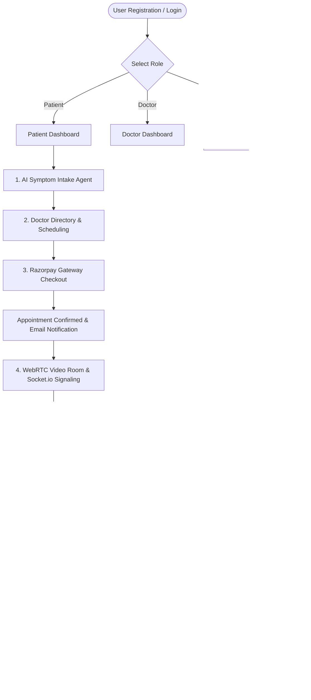

# 🗺️ MediCare AI Roadmap & Architecture Plan

Welcome to the official development blueprint for **MediCare AI**. This document maps out the system architecture, features, learning path, and stack categorization for building a complete Full-Stack + Telehealth + AI-driven clinical platform.

---

## 🏗️ Core Architecture & Flow Diagram



---

## 🚀 Phase-by-Phase Feature Breakdown

### Phase 1: Core Full-Stack (MERN Core)
*Existing foundation. Verify and polish before expanding:*
- **Patient Side:** Profile, Doctor search/filters, Slot booking, Status checks, Razorpay Payments.
- **Doctor Side:** Slot availability configuration, Appt Request approval, Case logs.
- **Messaging:** Basic Socket.io text chat during active rooms.
- **Backend:** Express routes, mongoose models, JWT middleware, Nodemailer triggers.

---

### Phase 2: AI Intake Agent 🤖
*Gather clinical history before the consultation starts.*
1. **Intake Flow:**
   - Prompt: *"What symptoms are you experiencing?"*
   - Context gathering: *"Since when? Any previous history? Any current medication?"*
2. **AI Processing:**
   - Groq API parses raw conversation using system prompts.
   - Outputs a **Structured JSON** object mapping patient condition parameters.
3. **Draft Schema:**
   ```json
   {
     "chiefComplaint": "Headache and mild fever",
     "duration": "3 days",
     "symptoms": ["fever", "headache", "weakness"],
     "history": "No previous chronic condition reported",
     "summary": "Patient reports mild fever accompanied by a persistent headache for 3 days."
   }
   ```
4. **Database persistence:** Details are associated with the current `Patient`/`Appointment` document.

---

### Phase 3: WebRTC Virtual Consultations ⭐⭐⭐
*Peer-to-peer secure audio/video stream.*
- **Signaling:** Use Socket.io to relay Session Description Protocol (SDP) `Offers`, `Answers`, and `ICE Candidates`.
- **Media Engine:** Native WebRTC API (`getUserMedia`, `RTCPeerConnection`).
- **Connection Fallback:** STUN/TURN server configuration to bypass NAT boundaries in production.

---

### Phase 4: Audio Transcription & SOAP Notes Generator 🎙️
*Automate doctor's paperwork post-consultation.*
1. **Audio Capture:** Record call audio streams.
2. **Transcription Engine:** Call **OpenAI Whisper** or deepgram APIs to convert conversational recordings to text transcripts.
3. **SOAP Classifier:** Feed conversational text transcript to Groq AI LLM to structure clinical documentation:
   - **S (Subjective):** Patient complaints, symptoms, duration.
   - **O (Objective):** Vital stats or observations during the call.
   - **A (Assessment):** Diagnoses or potential issues.
   - **P (Plan):** Next steps, tests, and prescriptions.
4. **Doctor-in-the-Loop:** Doctor reviews the AI-generated SOAP notes, edits the fields, and submits/approves to update records.

---

### Phase 5: AI-Assisted Prescription System 💊
- AI drafts medication plans based on SOAP Assessment.
- Fields: `Medicine Name`, `Dosage`, `Frequency`, `Duration`, `Special Instructions`.
- **Critical Requirement:** Doctor reviews, modifies, and signs the prescription to generate the final patient record.

---

### Phase 6: Rule-Based & ML Triage (Severity Engine)
- **Version 1 (Rule-Based):** Static classification (Age, symptoms count, duration) mapping to low/high priority labels.
- **Version 2 (ML Engine):** Python-based classification models (Scikit-learn, Pandas) running on historical records to generate probability scores.

---

## 🛠️ Tech Stack Categorization

### LEVEL 1 — Must Know (Core Foundations)
- **Web:** HTML, CSS, JavaScript (ES6+), React
- **Backend:** Node.js, Express.js, MongoDB, Mongoose, REST APIs, JWT Auth
- **VCS & Deploy:** Git/GitHub, Vercel (Client), Render (Server)

### LEVEL 2 — Advanced Platform Features
- **Realtime:** Socket.IO, WebRTC Signaling
- **Integrations:** Nodemailer, Razorpay SDK
- **Security:** bcrypt password hashing, Role-based Route Protection (Patient vs. Doctor vs. Admin)

### LEVEL 3 — AI/ML Integration
- **LLM APIs:** Groq API SDK, Prompt engineering, Structured JSON outputs
- **Speech-to-Text:** Whisper API, file upload streaming
- **Traditional ML (Later stage):** Python, NumPy, Pandas, Scikit-learn (for triage probability engines)

---

## 🧠 Structured Learning & Implementation Path

```text
[1] Core JS/React ──> [2] Express/Mongo Backend ──> [3] REST & JWT Auth ──> [4] Socket.io/WebRTC 
                                                                                   │
                                                                                   ↓
[8] Python & ML Classifier <── [7] Whisper Speech API <── [6] Groq AI Integration ◄┘
```

---

> [!IMPORTANT]
> **Safety Guardrail:** Never allow AI to automatically issue medical diagnosis or finalize prescriptions without the active approval and validation of a registered practitioner (Doctor-in-the-loop).
